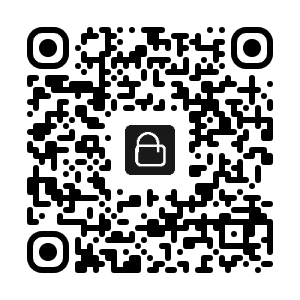
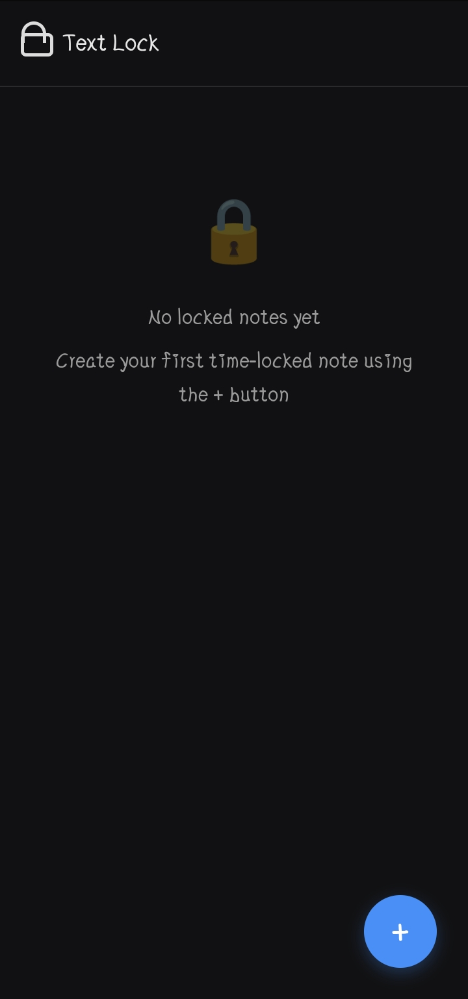
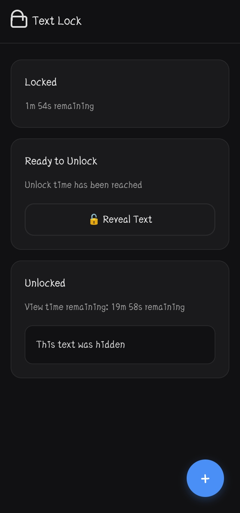
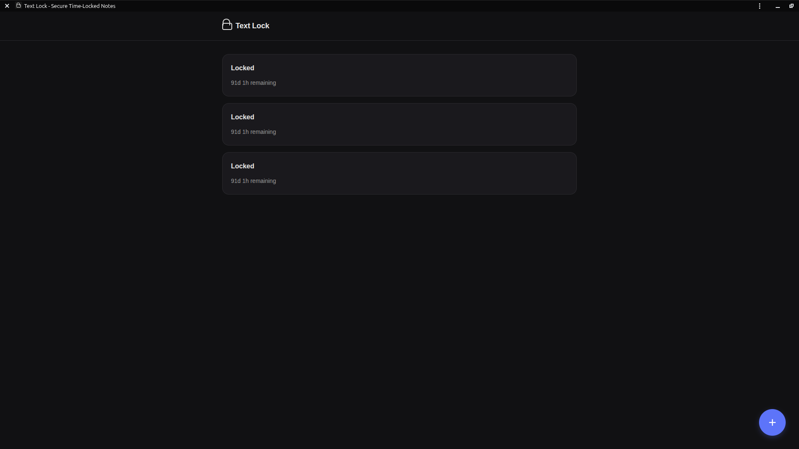

# 🔒 TextLock

<div align="center">



**Time-locked encryption for your secrets. Write now, reveal later.**

[](LICENSE)
[](https://web.dev/progressive-web-apps/)
[](https://developer.mozilla.org/en-US/docs/Web/API/SubtleCrypto)

[Live Demo](https://your-username.github.io/textlock) • [Report Bug](https://github.com/your-username/textlock/issues) • [Request Feature](https://github.com/your-username/textlock/issues)

</div>

---

## 📖 About

TextLock is a Progressive Web App (PWA) that enables users to create time-locked encrypted messages using client-side AES-256-GCM encryption. Messages remain cryptographically inaccessible until a specified unlock time, with automatic self-destruction after viewing.

Perfect for creating future self messages, timed surprises, digital time capsules, and temporary secure note storage.

## ✨ Features

- ⏰ **Time-Locked Encryption** - Set future unlock times for your encrypted messages
- 🔐 **Military-Grade Security** - AES-256-GCM encryption with PBKDF2 key derivation (100,000 iterations)
- 🔥 **Self-Destructing Messages** - 20-minute viewing window before permanent deletion
- 🚫 **Zero Knowledge** - All encryption happens client-side in your browser
- 📱 **Progressive Web App** - Install as native app on any platform (Android, iOS, Desktop)
- ⚡ **Offline-First** - Works completely offline after first visit
- 🎨 **Modern UI** - Clean, elegant interface with dark/light theme support
- 🔒 **No Tracking** - No accounts, no analytics, no data collection

## 📸 Screenshots

### Mobile Interface

<p align="center">
  
  
</p>

*Left: Empty state with create prompt | Right: Multiple locked notes with countdown timers*

### Desktop Experience

<p align="center">
  
</p>

*Desktop view showing locked notes in a clean, minimal interface*

## 🚀 Live Demo

**[Try TextLock Now →](https://shroomcoder.github.io/textlock)**

Or scan the QR code:

<p align="center">
  
</p>

## 🛠️ Technology Stack

| Category | Technology |
|----------|-----------|
| **Encryption** | Web Crypto API (AES-256-GCM, PBKDF2, SHA-256) |
| **Storage** | LocalStorage (client-side only) |
| **Frontend** | Vanilla JavaScript, HTML5, CSS3 |
| **Styling** | Custom CSS with CSS Variables |
| **PWA** | Service Workers, Web App Manifest |
| **Hosting** | GitHub Pages / Static hosting |

## 📋 Use Cases

| Use Case | Description |
|----------|-------------|
| 💭 **Future Self Messages** | Leave advice, encouragement, or reminders for yourself |
| 🎁 **Timed Surprises** | Create messages that unlock on birthdays or special occasions |
| ✍️ **Digital Time Capsules** | Capture thoughts and memories to unlock years from now |
| 🔐 **Temporary Secure Storage** | Store passwords or private info you need access to later |
| 🎯 **Goal Tracking** | Set goals and lock motivational messages to open on target dates |
| 📝 **Journaling** | Write daily reflections and lock them to review later periodically |

## 🔐 How It Works

```
1. WRITE    → Create your message and set an unlock time
2. ENCRYPT  → Message encrypted with AES-256-GCM using timestamp as part of key
3. LOCK     → Message cryptographically inaccessible until unlock time
4. REVEAL   → At specified time, decrypt and view your message
5. DESTRUCT → Message automatically deletes after 20 minutes
```

### Security Architecture

```
┌─────────────────────────────────────────────────────────────┐
│  User Input                                                 │
│  ├─ Message Text                                           │
│  └─ Unlock Timestamp                                       │
└─────────────────────────────────────────────────────────────┘
                           ↓
┌─────────────────────────────────────────────────────────────┐
│  Key Derivation (PBKDF2)                                   │
│  ├─ Salt: "text-lock"                                      │
│  ├─ Iterations: 100,000                                    │
│  ├─ Hash: SHA-256                                          │
│  └─ Input: Unlock Timestamp                                │
└─────────────────────────────────────────────────────────────┘
                           ↓
┌─────────────────────────────────────────────────────────────┐
│  AES-256-GCM Encryption                                    │
│  ├─ Random IV (12 bytes)                                   │
│  ├─ Derived Key (256 bits)                                 │
│  └─ Encrypted Data                                         │
└─────────────────────────────────────────────────────────────┘
                           ↓
┌─────────────────────────────────────────────────────────────┐
│  LocalStorage                                              │
│  ├─ Encrypted Payload                                      │
│  ├─ IV                                                     │
│  ├─ Unlock Timestamp                                       │
│  └─ View Expiry (after unlock)                            │
└─────────────────────────────────────────────────────────────┘
```

## 💻 Installation

### As a Web App (Recommended)

#### 🤖 Android (Chrome)

1. Visit [TextLock](https://shroomcoder.github.io/textlock)
2. Tap menu (⋮) → "Install app"
3. Tap "Install"

#### 🍎 iOS (Safari)

1. Visit [TextLock](https://shroomcoder.github.io/textlock)
2. Tap Share (↑) → "Add to Home Screen"
3. Tap "Add"

#### 💻 Desktop (Chrome/Edge/Brave)

1. Visit [TextLock](https://shroomcoder.github.io/textlock)
2. Click install icon (⊕) in address bar
3. Click "Install"

### Run Locally

```bash
# Clone the repository
git clone https://github.com/shroomcoder/textlock.git
cd textlock

# Serve with any static server
python3 -m http.server 8080

# Or use Node.js
npx http-server -p 8080

# Open http://localhost:8080
```

## 📁 Project Structure

```
textlock/
├── index.html              # Router page (redirects based on install status)
├── landing.html            # Marketing landing page
├── app.html               # Main application interface
├── manifest.json          # PWA manifest
├── sw.js                 # Service worker for offline support
├── style.css             # App styles
├── landing.css           # Landing page styles
├── app.js                # Application logic & encryption
├── landing.js            # Landing page scripts
├── icons/                # App icons
│   ├── icon-192.png
│   ├── icon-512.png
│   └── textlock.ico
└── screenshots/          # Reference images
    ├── qr-code.png
    ├── empty-state.jpg
    ├── locked-notes.jpg
    └── desktop-view.png
```

## 🌐 Browser Support

| Browser | Desktop | Mobile | PWA Support |
|---------|---------|--------|-------------|
| Chrome  | ✅ | ✅ | ✅ |
| Edge    | ✅ | ✅ | ✅ |
| Brave   | ✅ | ✅ | ✅ |
| Firefox | ✅ | ✅ | ⚠️ Limited |
| Safari  | ✅ | ✅ | ⚠️ Limited |
| Opera   | ✅ | ✅ | ✅ |

⚠️ **Note:** Safari has limited PWA support but app functionality works fully.

## 🔧 Development

### Prerequisites

- Modern web browser
- Basic HTTP server (Python, Node.js, etc.)
- Text editor / IDE

### Local Development

```bash
# 1. Clone repository
git clone https://github.com/shroomcoder/textlock.git
cd textlock

# 2. Start local server
python3 -m http.server 8080

# 3. Open in browser
open http://localhost:8080

# 4. Make changes and refresh browser
```

### Testing PWA Features

```bash
# Test service worker
# Open DevTools → Application → Service Workers

# Test manifest
# Open DevTools → Application → Manifest

# Test offline mode
# Open DevTools → Network → Check "Offline" → Reload
```

## 🤝 Contributing

Contributions are welcome! Please feel free to submit a Pull Request.

### How to Contribute

1. Fork the repository
2. Create your feature branch
   ```bash
   git checkout -b feature/AmazingFeature
   ```
3. Commit your changes
   ```bash
   git commit -m 'Add some AmazingFeature'
   ```
4. Push to the branch
   ```bash
   git push origin feature/AmazingFeature
   ```
5. Open a Pull Request

### Development Guidelines

- Follow existing code style
- Test on multiple browsers
- Ensure PWA features work
- Update documentation
- Add screenshots for UI changes

## 🔒 Security

### Encryption Details

- **Algorithm:** AES-256-GCM (Authenticated Encryption)
- **Key Derivation:** PBKDF2 with 100,000 iterations
- **Hash Function:** SHA-256
- **IV:** Random 12-byte initialization vector per message
- **Implementation:** Native Web Crypto API

### Security Model

✅ **What TextLock Protects:**
- Message content is encrypted with strong AES-256-GCM
- Unlock time is cryptographically enforced via key derivation
- No server-side storage or transmission
- No user tracking or analytics

⚠️ **Important Limitations:**
- Encrypted data stored in browser's localStorage
- Technically skilled users could potentially access localStorage
- Not a replacement for server-side encrypted storage
- Best suited for personal notes and non-critical information

### For Highly Sensitive Data

For mission-critical or highly sensitive information, use dedicated security solutions with:
- Server-side encryption at rest
- Secure key management systems
- Multi-factor authentication
- Audit logging

## 📄 License

This project is licensed under the MIT License - see the [LICENSE](LICENSE) file for details.

```
MIT License

Copyright (c) 2026 mnxhh_eko

Permission is hereby granted, free of charge, to any person obtaining a copy
of this software and associated documentation files (the "Software"), to deal
in the Software without restriction, including without limitation the rights
to use, copy, modify, merge, publish, distribute, sublicense, and/or sell
copies of the Software, and to permit persons to whom the Software is
furnished to do so, subject to the following conditions:

The above copyright notice and this permission notice shall be included in all
copies or substantial portions of the Software.

THE SOFTWARE IS PROVIDED "AS IS", WITHOUT WARRANTY OF ANY KIND, EXPRESS OR
IMPLIED, INCLUDING BUT NOT LIMITED TO THE WARRANTIES OF MERCHANTABILITY,
FITNESS FOR A PARTICULAR PURPOSE AND NONINFRINGEMENT. IN NO EVENT SHALL THE
AUTHORS OR COPYRIGHT HOLDERS BE LIABLE FOR ANY CLAIM, DAMAGES OR OTHER
LIABILITY, WHETHER IN AN ACTION OF CONTRACT, TORT OR OTHERWISE, ARISING FROM,
OUT OF OR IN CONNECTION WITH THE SOFTWARE OR THE USE OR OTHER DEALINGS IN THE
SOFTWARE.
```

## 🙏 Acknowledgments

- Encryption powered by [Web Crypto API](https://developer.mozilla.org/en-US/docs/Web/API/Web_Crypto_API)
- Icons from [Google Material Icons](https://fonts.google.com/icons)
- Fonts: [Playfair Display](https://fonts.google.com/specimen/Playfair+Display) & [Inter](https://fonts.google.com/specimen/Inter)
- Inspired by the need for simple, client-side time-locked encryption

## 📞 Contact & Support

- **Issues:** [GitHub Issues](https://github.com/shroomcoder/textlock/issues)
- **Discussions:** [GitHub Discussions](https://github.com/shroomcoder/textlock/discussions)
- **Email:** org.textlock@gmail.com


<div align="center">

**Built with ❤️ using vanilla JavaScript**

⭐ Star this repo if you find it useful!

[🔒 Try TextLock](https://shroomcoder.github.io/textlock) | [📖 Documentation](https://github.com/shroomcoder/textlock/wiki) | [🐛 Report Bug](https://github.com/shroomcoder/textlock/issues)

</div>
